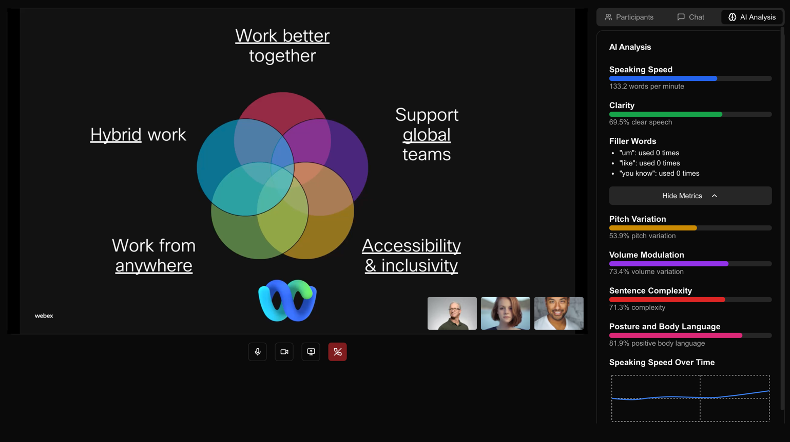
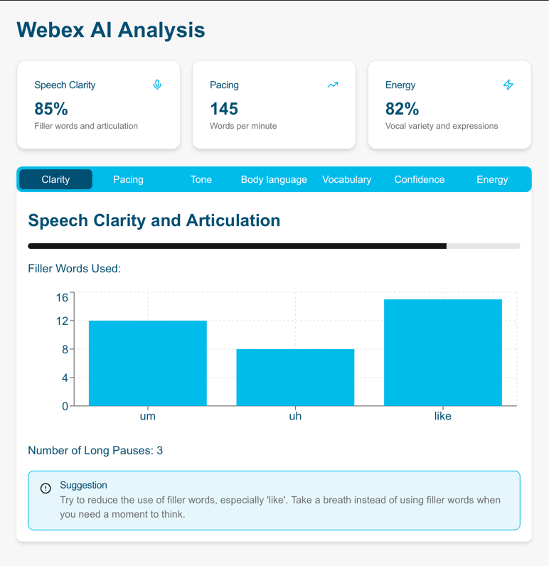

# Webex AI Speech Assistant Prototype

This is a nonfunctional prototype of a Webex AI speech assistant for 2024 Catalyst HackAIthon @ Cisco.

## Core Ideas

- Real-Time Feedback: Keep it minimal to avoid overwhelming the speaker. Brief visual cues (e.g., pacing indicator, tone
  variability) can be subtle
- Audience Tools: give feedback on users. For example, avoid falling asleep during meeting or correct your posture to
  look more engaged
- Post-Session Summary: Offer an interactive dashboard or report with highlights on pacing, engagement, filler word
  count, and more.




## Getting Started

First, run the development server:

```bash
npm run dev
# or
yarn dev
# or
pnpm dev
# or
bun dev
```

Open [http://localhost:3000](http://localhost:3000) with your browser to see the result.